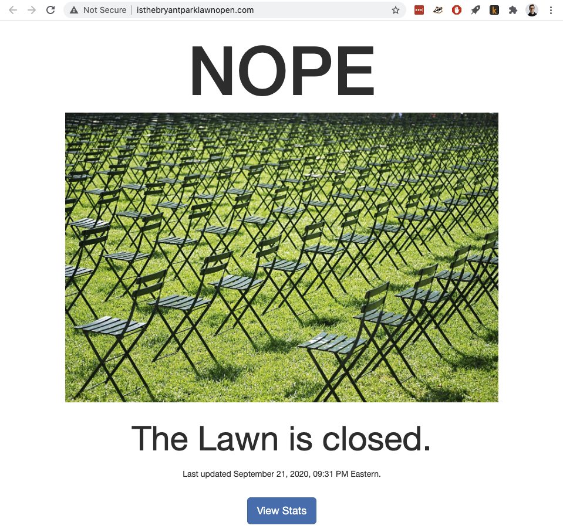

# <a href="www.isthebryantparklawnopen.com">isTheBryantParkLawnOpen.com</a>

Proffers a binary answer to the question in the domain name:

## <a href="https://towardsdatascience.com/ditching-the-aws-gui-console-ac77f46a05fa">Full project write-up on Medium</a>

Uses AWS Lambda to scrape the web with a headless browser, collecting one bit of information. Saves that binary variable to a database and references that database to keep an s3 bucket site updated. Renders some aggregate statistics as plotly visualizations on a second page.

It's a hello-worldy project I undertook mostly just to dive a little deeper with AWS:
- CloudFormation
- Lambda / SAM
- S3
- RDS
- VPC / Cloud Networking