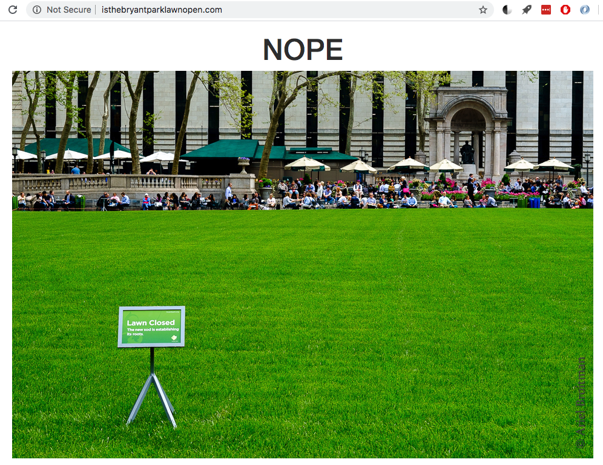

# isTheBryantParkLawnOpen.com

www.isthebryantparklawnopen.com

Tells you whether or not the Bryant Park Lawn is open.

I made this because I used to work around the corner from Bryant Park. Sometimes I would want to know (before I left for lunch) whether or not the lawn was open: If it was open, I would go eat lunch in the grass. If it was closed, I would just come straight back to the office to eat. The bryantpark.org domain took too long to load (with lots of extra images and info), so I set out to create a simpler webpage for my singular purpose.

It was also an excuse to get familiar with AWS. This small project evolved from scripts meant to be run on ec2 server -> to AWS Lambda jobs. The lambda jobs scrape the bryantpark.org website for lawn (open/closed) status, and cache that binary result to an s3 bucket site.

#TODO: Bryant Park does not have a lawn during the winter, just an ice rink. The website should reflect this.
