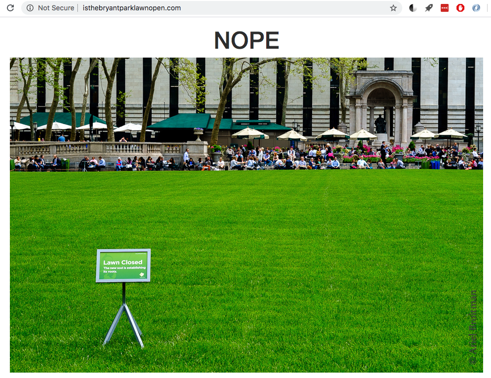

# isTheBryantParkLawnOpen.com

www.isthebryantparklawnopen.com

A single serving website. Provides a binary answer:

It's a hello-worldy project used to familiarize myself with AWS:
- S3
- Lambda / SAM
- RDS
- CloudFormation

#TODO: Bryant Park does not have a lawn during the winter, just an ice rink. The website should reflect this.